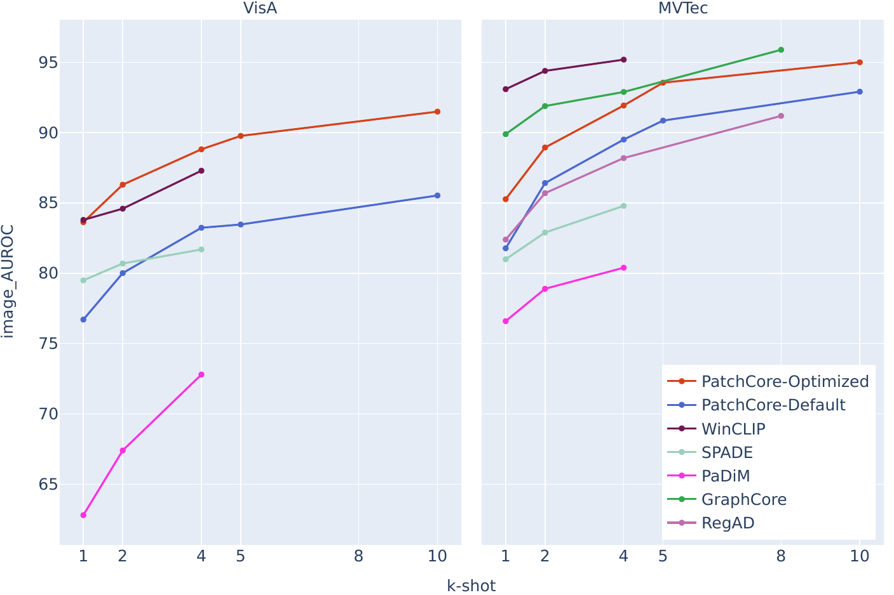

# Optimizing PatchCore for Few/many-shot Anomaly Detection

This repository contains the implementation of our paper titled: **["Optimizing PatchCore for Few/many-shot Anomaly Detection"](https://arxiv.org/abs/2307.10792)**.
We achieve a new state-of-the-art in few-shot Anomaly Detection on Visa by optimizing PatchCore, and furthermore won the the few-shot Anomaly Detection track of the [VAND challenge at CVPR 2023](https://sites.google.com/view/vand-cvpr23/challenge) with this approach.
Most notably, we leverage a more constrained (i.e. anti-aliased) feature extractor to do this.
For more details, please check the paper.

<p align="center">
    
</p>

## Computing environment
For our experiments, we used a machine with a Intel(R) Xeon(R) Silver 4110 CPU @ 2.10GHz and a GeForce GTX 1080 Ti GPU with 11GB of VRAM running on the Ubuntu 22.04 OS.
Parameters like batch size were determined based on this hardware, so feel free to change them.
The instructions below were made considering an Ubuntu distribution.

By default the code requires having a GPU installed. TO use only CPU, change the parameter `trainer.devices` to `1` inside `src/anomalib/models/config.yaml`

## Installation and running
* Extract the code into your home directory and change directory: `cd ~/patchcore-few-shot/`
* (Optional, but recommended) Create a virtual environment with python 3.8, you can use pyenv or another python environment manager. 
* Install dependencies in editable mode: `pip install -e .`
* The experiments done in the paper can be reproduced by running the bash scripts inside the `experiments` directory.

## Code structure
We based our code on the open-source package [anomalib](https://github.com/openvinotoolkit/anomalib) and modified it according to our needs.
Anomalib is a great package with a lot of different algorithms implementation, so do check it out!

```
patchcore-few-shot/
├── experiments        # Bash scripts to reproduce our paper's experiments
│
├── requirements       # python package dependencies
|
├── scripts            # python scripts called in our experiments
│
└── src                # main source code
```

## Citation

If you find our work useful, please consider citing it

```
@misc{santos2023optimizing,
      title={Optimizing PatchCore for Few/many-shot Anomaly Detection}, 
      author={João Santos and Triet Tran and Oliver Rippel},
      year={2023},
      eprint={2307.10792},
      archivePrefix={arXiv},
      primaryClass={cs.CV}
}
```